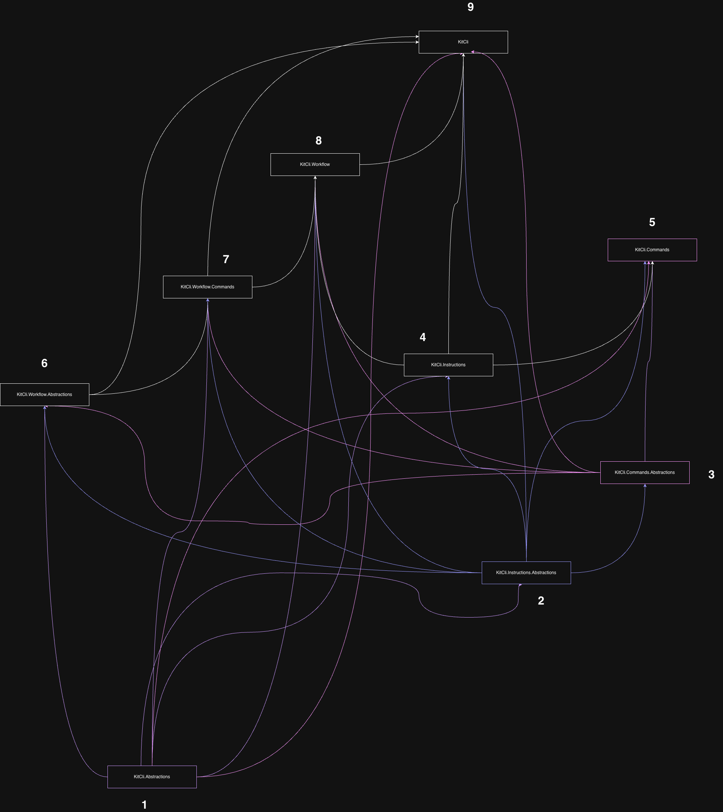

# KitCli

Create an extensible CLI in minutes. A .NET framework for building
terminal apps: DI-driven command dispatch (via MediatR), with
Commands/Outcomes/Artefacts/Workflow layers on top for state that
carries across a session — page size, filters, "next page" — without
each command hand-rolling it.

- [Requirements](#requirements)
- [Installation](#installation)
- [Quick start](#quick-start)
- [Project structure](#project-structure)
- [Build and test](#build-and-test)
- [Documentation](#documentation)
- [Packages](#packages)
- [Contributing](#contributing)
- [License](#license)

## Requirements

- [.NET 10 SDK](https://dotnet.microsoft.com/download/dotnet/10.0) — every
  project targets `net10.0`.

## Installation

```bash
dotnet add package KitCli
```

`KitCli` is the umbrella package. It pulls in everything you need to build
an app; reference the others directly only when you are extending the
framework rather than consuming it.

## Quick start

```csharp
// A command — just a marker type.
public record HelloCliCommand : CliCommand;

// Decides when this command applies, and builds it.
public class HelloCliCommandFactory : CliCommandFactory<HelloCliCommand>
{
    public override bool CanCreateWhen() => true;
    public override CliCommand Create() => new HelloCliCommand();
}

// Does the actual work.
public class HelloCliCommandHandler : CliCommandHandler<HelloCliCommand>
{
    public override Task<Outcome[]> HandleCommand(HelloCliCommand command, CancellationToken ct)
        => FinishThisCommand()
            .ByFinallySaying("Hello, World!")
            .EndAsync();
}

// Registers every command in this assembly.
public class HelloRegistry : ICliAppRegistry
{
    public void Register(IServiceCollection services)
        => services.AddCommandsFromAssembly(typeof(HelloCliCommand).Assembly);
}
```

```csharp
// Program.cs
var app = new CliAppBuilder()
    .WithBasicTerminalApp()
    .WithRegistry<HelloRegistry>();

await app.Run();
```

Run it and type `/hello` (or the shorthand, `/h`) — a command's
invocation name is derived from its type name automatically, not
declared anywhere: `HelloCliCommand` → `hello` / `h`.


## Project structure

```
KitCli/                              the umbrella package: CliApp, CliAppBuilder
KitCli.Abstractions/                 ICliIo, Aggregator, Table
KitCli.Instructions[.Abstractions]/  parsing an ask into a typed Instruction
KitCli.Commands[.Abstractions]/      CliCommand, factories, outcomes, artefacts
KitCli.Workflow[.Abstractions]/      the run state machine
KitCli.Workflow.Commands/            built-in commands (/exit)

KitCli.Playground.*/                 runnable sample apps and scenarios
KitCli.Tooling.Release/              the release CLI, itself built with KitCli
*.Tests, *.IntegrationTests/         six test projects
```



## Build and test

```bash
dotnet restore KitCli.sln
dotnet build KitCli.sln
dotnet test KitCli.sln
```

CI runs those three steps on every PR and every push to `main`, across all
six test projects. To see the framework running, start a playground app:

```bash
dotnet run --project KitCli.Playground.App.Terminal     # interactive
dotnet run --project KitCli.Playground.App.Args -- /echo --name Alex   # one-shot
```

## Documentation

- [`CONTRIBUTING.md`](CONTRIBUTING.md) — conventions, branching, how to
  propose a change.
- [`docs/user-guides/`](docs/user-guides/) — how to use a pattern in
  practice, without needing to know the machinery underneath:
  [writing a basic command](docs/user-guides/0001-writing-a-basic-command.md),
  [reading command arguments](docs/user-guides/0005-reading-command-arguments.md),
  [exiting the app](docs/user-guides/0012-exiting-the-app.md),
  [creating a terminal app](docs/user-guides/0003-creating-a-terminal-app.md),
  [creating an args app](docs/user-guides/0002-creating-an-args-app.md),
  [creating a registry](docs/user-guides/0004-creating-a-registry.md),
  [chaining commands](docs/user-guides/0007-chaining-commands.md),
  [remembering state across asks](docs/user-guides/0010-reusable-outcomes-and-the-workflow-run.md),
  [command reactions](docs/user-guides/0008-command-reactions.md),
  [showing a paged table](docs/user-guides/0011-showing-a-paged-table.md),
  [remembering your own state](docs/user-guides/0009-remembering-your-own-state.md),
  and [gating a command with CanCreateWhen](docs/user-guides/0006-gating-a-command-with-cancreatewhen.md).
- [`docs/concepts/`](docs/concepts/) — how each subsystem works today:
  [command registration](docs/concepts/0001-command-registration.md),
  [instruction parsing](docs/concepts/0005-instruction-parsing-pipeline.md),
  the [workflow state machine](docs/concepts/0010-workflow-run-state-machine.md),
  the [host loop](docs/concepts/0002-cli-app-host.md),
  [CLI I/O](docs/concepts/0003-cli-io.md) and
  [outcome writing](docs/concepts/0004-outcome-writing.md),
  [outcomes](docs/concepts/0006-outcomes.md) and
  [artefacts](docs/concepts/0008-artefacts.md),
  [aggregators](docs/concepts/0007-aggregators.md) and
  [tables](docs/concepts/0009-tables.md).
- [`docs/adr/`](docs/adr/) — architectural decisions and why.
- [`docs/reviews/`](docs/reviews/) — past architectural reviews.

## Packages

`KitCli` (the umbrella package) plus 8 supporting packages
(`KitCli.Abstractions`, `KitCli.Instructions[.Abstractions]`,
`KitCli.Commands[.Abstractions]`, `KitCli.Workflow[.Abstractions]`,
`KitCli.Workflow.Commands`) — see
[`CONTRIBUTING.md`](CONTRIBUTING.md#versioning--releases) for how
they're versioned and released.

Versions have drifted apart rather than shipping in lockstep as intended —
see [#58](https://github.com/KitCli/KitCli/issues/58).

## Contributing

Read [`CONTRIBUTING.md`](CONTRIBUTING.md) first — it covers Conventional
Commit titles, the label taxonomy, PR size limits, and when a change needs
an ADR or a concept doc.

## License

[MIT](LICENSE).
