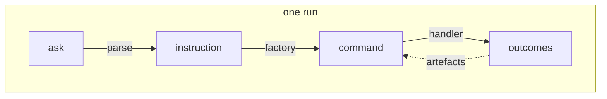

# KitCli documentation

New here? Read [the words below](#the-seven-words) first — every other page
assumes them. Then pick a folder.

| Folder | Answers | Read it when |
| --- | --- | --- |
| [`user-guides/`](user-guides/0001-writing-a-basic-command.md) | How do I do X? | You are building an app with KitCli. |
| [`concepts/`](concepts/0001-command-registration.md) | How does X work? | A guide left you wondering why. |
| [`adr/`](adr/0001-mediatr-for-command-dispatch.md) | Why is X like this? | You want to change something and need the reason it is that way. |
| [`investigations/`](investigations/0002-which-extension-points-can-use-a-consumers-lifetimes.md) | What did we find out? | You are picking up work a spike scoped. |
| [`technology/`](technology/microsoft-dependency-injection.md) | What can I do with KitCli's dependency X? | You are asking "does the container support…". |
| [`reviews/`](reviews/0001-architectural-review.md) | What was wrong on a given date? | Historical only. Never current state. |

Start at [writing a basic command](user-guides/0001-writing-a-basic-command.md).
[`CONTRIBUTING.md`](https://github.com/KitCli/KitCli/blob/main/CONTRIBUTING.md) says when to write each kind, and
`0000-template.md` in each folder is the skeleton to copy.

## The seven words

KitCli names the stages between a user typing something and something
happening. Every page uses these words and no page redefines them.

| Word | Means |
| --- | --- |
| **ask** | One line the user typed. A headless app's ask is its process args, joined. |
| **instruction** | An ask, parsed: a name, an optional sub-name, and typed arguments. |
| **command** | The typed request an instruction resolves to. Usually a record with no behaviour. |
| **factory** | Decides whether a command applies right now, and builds it. |
| **handler** | Does the work, and returns outcomes. |
| **outcome** | One thing the command produced: show the user this, or change what happens next. |
| **artefact** | An outcome made queryable, so a later command in the same run can read it. |

One more, and it is the one that catches people out: a **run** is the whole
arc from an ask to a final outcome, however many commands that takes. State
survives inside a run and dies with it.

