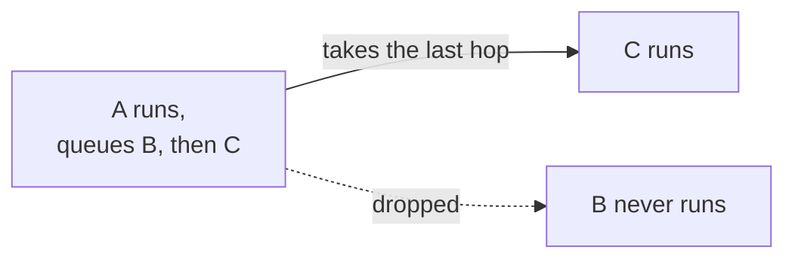
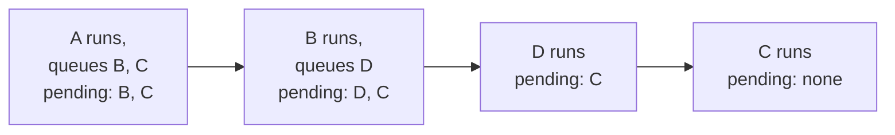

# 0016. Run every queued hop, depth-first

Status: Proposed
Date: 2026-08-29

Settles the selection rule left open by
[#152](https://github.com/KitCli/KitCli/issues/152), ticket 3 of
[#147](https://github.com/KitCli/KitCli/issues/147).

## Context

A command can finish by queueing another command to run next — a hop. The
user types one thing and the app runs a chain of commands before asking
again. A handler can queue several hops, because the fluent builder
appends whatever it is given, but the run executes only one of them:
`MoveToNext()` scans everything the run has produced and takes the last
hop queued. Queue five and four vanish, silently. Whether the run
continues at all is also decided by whichever outcome happens to sit last
in the handler's list, so a hop followed by a message never hops.

Nothing records which hops were already taken. The run does keep its full
history — each step stores the outcomes it produced, including a record
of the command that ran — but `CliWorkflowRun` re-reads that raw history
in place, each time, itself.

## Decision

Every queued hop runs, in the order written. When a hop's own command
queues further hops, those run first and the earlier queue then resumes —
nested to-do lists. A queues B then C, B queues D: the order is A, B, D,
C. An existing chain keeps its exact meaning when a sibling is stacked
behind it.

Each box is one step: what runs, what it queues, and what is left waiting
afterwards. B's own hop D lands at the front of the pending list, so it
runs before A's remaining plan resumes.

The hops still waiting are derived, not stored: replay the history — an
executed step consumes the front of the pending list, its new hops go on
the front. The replay is an extension over what `ICliWorkflowRunState`
already exposes (`AllOutcomeStateChanges()`), not a new interface member;
`CliWorkflowRun` asks "any hop pending?" and "which is next?", never
interpreting raw history itself. Factories still
receive the flat outcome history as data — the state hides
interpretation, not the outcomes.

## Alternatives considered

- **One hop only, throw on a second** (#152's fallback) — bans a shape
  the builder invites; the fluent calls read "then B, then C".
- **New hops at the back of the queue** — a one-line derivation (skip one
  hop per step taken), but stacking a sibling reorders an existing
  chain's own follow-ups.
- **Earliest hop with no matching ran-record**
  ([#124](https://github.com/KitCli/KitCli/issues/124)) — matches on the
  command, so two hops to the same command type are indistinguishable.
- **An explicit queue field on the run** — state that can drift from a
  history that already holds enough.

## Consequences

- List position stops mattering: a hop followed by a message now hops.
  A behavior change, so a `CHANGELOG.md` entry ships with the code.
- The public API only gains: no type changes shape and the interface
  gains no member, so this is a minor release, not a major.
- Rewrites ADR 0011's "still takes the last queued hop" consequence.
- The move-past-ask guard asks the state, so hops consumed steps ago no
  longer count as pending — a latent bug gone.
- Depth-first costs a replay instead of a skip-count; it is one
  well-named method on the state, pinned by ordering tests.
- Still nothing detects an unending chain
  ([#173](https://github.com/KitCli/KitCli/issues/173)).
