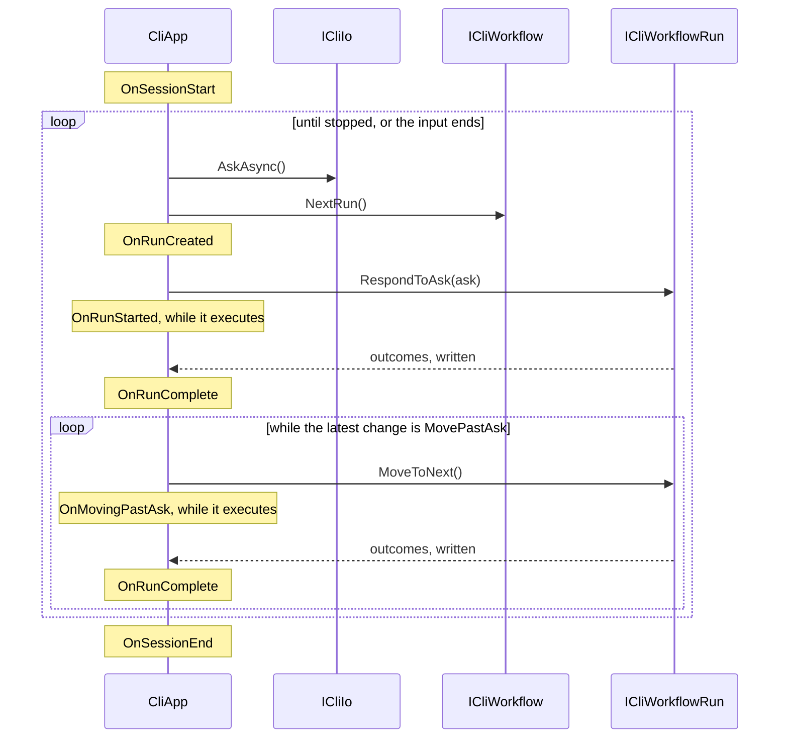

# 0002. CliApp host loop

Something has to fetch what the user typed, run it, and print what came
back. That is the host. `CliApp` is it: the shell around a workflow.

`CliApp` *is* the interactive app — ask, run, ask again. `HeadlessCliApp`
overrides `Run` for `myapp /command --flag value`, where nothing is
attached to the input. Both are abstract; `BasicCliApp` is the ready-made
interactive one that `WithBasicApp()` gives you.

```csharp
OnSessionStart();
Io.Pause();
SetUpEventHandlers();

while (Workflow.Status != CliWorkflowStatus.Stopped)
{
    var ask = await Io.AskAsync(Workflow.CancellationToken);
    if (ask is null) break;
    await ExecuteRunOperation(ask, outcomeIoWriters);
}

OnSessionEnd(Workflow.Runs);
```

`ExecuteRunOperation` responds to the ask, then keeps calling `MoveToNext()`
while the run's latest state change is `MovePastAsk`, writing each step's
outcomes as it goes. That is why a chain arrives whole under either host.



`HeadlessCliApp` runs the outer loop's body once, with the process args
joined into the ask; the inner loop still runs a whole chain.

## A headless session is one run, however far it gets

`HeadlessCliApp.Run` opens the session, calls `ExecuteRunOperation` once
with the process args joined into an ask, stops the workflow, and ends.
Chained steps run. What cannot happen is a *second* run, because nothing
can be asked — so a run left waiting at a reusable checkpoint stops there,
unfinished, its DI scope undisposed. Which class you extend decides the
mode for the life of the class, and `CliAppBuilder.Run` throws if a
`HeadlessCliApp` gets no args
([ADR 0013](../adr/0013-merge-the-hosts-and-name-the-variant-headless.md)).

Six `protected virtual` hooks — `OnSessionStart`, `OnRunCreated`,
`OnRunStarted`, `OnMovingPastAsk`, `OnRunComplete`, `OnSessionEnd` — let an
app watch a session without overriding `Run`. None redirects flow, and
`OnRunStarted`/`OnMovingPastAsk` fire *while* the run executes, so they
suit progress indicators rather than setup. All six fire under both hosts,
`OnRunComplete` once per step rather than once per ask. An
`ExceptionOutcome` is rethrown before its outcomes are written.

## Everything outside a run is a singleton

`CliAppBuilder.Run` builds the provider with `ValidateScopes` and
`ValidateOnBuild` on, then resolves the `CliApp` and its writers once from
the root. Those live for the whole app; only handlers get per-run
instances. **A singleton depending on a `Scoped` service fails at
startup**, naming both types, instead of silently capturing one.

## Gaps

- A chain that hands on forever never returns, and nothing detects it.
  `/test-unending-chain` in the playground does it.
  [#173](https://github.com/KitCli/KitCli/issues/173)
- A chain that stops without a final outcome leaves its run unfinished and
  its scope undisposed, silently.
  [#168](https://github.com/KitCli/KitCli/issues/168)

## See also

[0010-workflow-run-state-machine.md](0010-workflow-run-state-machine.md) ·
[0003-cli-io.md](0003-cli-io.md) · [0004-outcome-writing.md](0004-outcome-writing.md)
