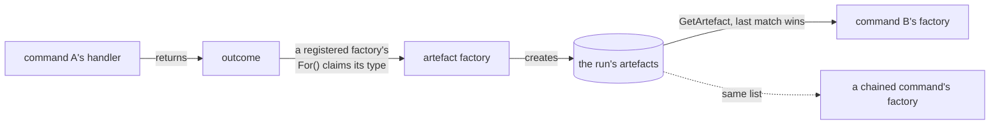

# 0008. Artefacts

An outcome belongs to the command that returned it, and nothing else can
reach it. An artefact is that same data made queryable by type and name
across the whole run — so a later command's factory can read what an
earlier command produced.

Three types make one:

```csharp
public record ThresholdOutcome(int Threshold) : Outcome(OutcomeKind.Reusable);

public record ThresholdArtefact(int Threshold)
    : Artefact<int>(nameof(Threshold), Threshold);

public class ThresholdArtefactFactory : ArtefactFactory<ThresholdOutcome>
{
    protected override AnonymousArtefact CreateArtefact(ThresholdOutcome outcome)
        => new ThresholdArtefact(outcome.Threshold);
}
```

Read it back in a factory with `GetArtefact<T>(name)` or
`GetRequiredArtefact<T>(name)`, which filter by type, then by name if
given, and take the **last** match. Set a value twice in a run and later
commands see the second.



**A chained command reads artefacts too.** A handler naming its successor
with `ByMovingToCommand<TCommand>()` has that command built by its factory,
attached to the same artefacts — so data reaches a chain through artefacts
rather than through the previous handler's local variables. See
[../user-guides/0007-chaining-commands.md](../user-guides/0007-chaining-commands.md).

## Registration takes a second call

Your registry must call `AddArtefactFactoriesForAssembly(assembly)`.
`AddCommandsFromAssembly` registers commands, factories, and handlers — but
**not** artefact factories. That one call registers four built-ins,
including the one behind `LastCommandWas<T>()`, then finds every
`ArtefactFactory<>` in the assembly, plus one for every closed
`Aggregator<,>` and `TableBuilder<,>`.

Miss the call and nothing fails at startup. The first symptom is
`GetRequiredArtefact` throwing at runtime.

`OutcomeKind` plays no part in any of this. An outcome becomes an artefact
when some registered factory's `For()` claims its type, whatever its kind.

## Gaps

`GetRequiredArtefact` and `GetRequiredArgument` throw bare `Exception`
despite a typed `CliException` hierarchy existing. Tracked as
[#34](https://github.com/KitCli/KitCli/issues/34).

## See also

[0006-outcomes.md](0006-outcomes.md) · [0001-command-registration.md](0001-command-registration.md) ·
[0005-instruction-parsing-pipeline.md](0005-instruction-parsing-pipeline.md)
