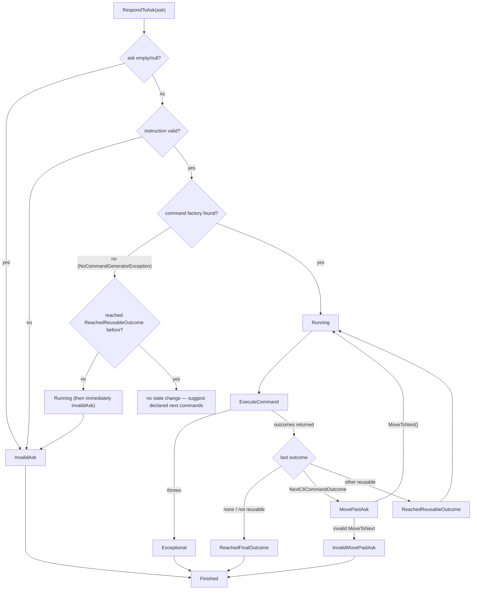

# Workflow run state machine

## Premise

Running a KitCli app means turning user input ("asks") into commands and
outcomes over and over, often across many command executions, without
losing track of what has happened. `ICliWorkflow` (`CliWorkflow.cs`) holds
a list of `ICliWorkflowRun`s. Each `CliWorkflowRun`
(`Run/CliWorkflowRun.cs`) is its own small state machine, tracking one
execution from "ask received" to "finished."

## Problem

At any point, the host (`CliApp`) needs answers to a few questions:

- Is this ask valid?
- Did the command that just ran finish the whole interaction outright,
  does it want another ask, or does it want to run again *without* a
  fresh ask (e.g. paging through a list)?
- What happens if parsing or validation fails, or the command handler
  throws?

Answering those consistently takes one enforced set of legal
transitions, not scattered booleans. Otherwise a run reaches an
inconsistent state — "reached its final outcome" and "still running" at
once — which shows up as a silent bug rather than an exception.

Two guarantees hold the line. `NextRun()` reuses only a run that has not
reached `Finished`, and each of the four terminating statuses
(`ReachedFinalOutcome`, `InvalidAsk`, `Exceptional`, `InvalidMovePastAsk`,
see the table below) drives the run to `Finished` before `RespondToAsk` or
`MoveToNext` returns. Together they rule out handing an already-`Finished`
run a fresh ask. The state machine has no `Finished -> *` transition, so
were either guarantee to slip, the next ask on that run would crash with
an uncaught `ImpossibleStateChangeException`.

## Solution

### The two levels

`CliWorkflow` is the top-level object: a `Runs` list plus a `Status` of
`Started` or `Stopped`. `NextRun()` does **not** always create a run. It
reuses the single run in `Runs` short of `Finished`, calling
`CreateNewRun()` only when none exists:

```csharp
public ICliWorkflowRun NextRun()
{
    var lastRunNotYetFinished = Runs
        .SingleOrDefault(run => !run.State.WasChangedTo(ClIWorkflowRunStateStatus.Finished));

    return lastRunNotYetFinished ?? CreateNewRun();
}
```

(`ClIWorkflowRunStateStatus` is spelled that way in the source — a typo in
the public enum's own name, tracked as
[#41](https://github.com/KitCli/KitCli/issues/41).)

Each `CliWorkflowRun` exposes two entry points:

- `RespondToAsk(string? ask)` parses fresh user input and runs the command
  it resolves to.
- `MoveToNext()` continues the *same run* into its next command, using
  what a prior outcome queued, without waiting on a new ask. Paging
  through a list uses this.

A run is not one command. It is the whole arc across as many commands and
asks as reaching a final outcome takes, and `MoveToNext` is the entry
point for those steps in the arc needing no fresh input.

`CreateNewRun()` also creates a DI scope for the run it builds
(`serviceScopeFactory.CreateScope()`) and resolves that run's
`IInstructionParser`, `IInstructionValidator`, `ICliWorkflowCommandProvider`,
`IOptions<InstructionSettings>`, `ISender`, and `IPublisher` from it, so a
`Scoped`-registered service gets
one instance per run rather than behaving like a singleton for the whole
process. `CliWorkflowRun` holds that scope and disposes it in
`UpdateStateWhenFinished()`, the same guard described below that fires
`ChangeTo(Finished)` — see
[0002-di-scope-per-workflow-run.md](../adr/0002-di-scope-per-workflow-run.md)
for why a run, rather than a single command, is the scope boundary.

`CreateNewRun()` passes `CliWorkflow`'s own `CancellationToken` into that
same constructor call, alongside the scope. `CliWorkflowRun` keeps it
private and uses it when calling `ISender.Send`. Neither `RespondToAsk`
nor `MoveToNext` takes a `CancellationToken` parameter: cancellation is
ambient to the run from creation, as the DI scope is, rather than
something every caller keeps supplying. A host (`CliApp`) signals it
through `CliWorkflow.InterruptCurrentRun()` — see
[0006-cooperative-cancellation.md](../adr/0006-cooperative-cancellation.md)
and [cli-io.md](cli-io.md) for how a Ctrl+C reaches it.

### The state machine itself

The run's state (`CliWorkflowRunState.cs`) is the finite state machine:
an append-only history of every status change, plus a fixed table of
allowed from/to pairs. Changing status looks up the most recent status,
checks the table, and throws when the transition is missing. That table
is the entire contract:

| From | To |
|---|---|
| `Created` | `InvalidAsk`, `Running` |
| `Running` | `InvalidAsk`, `Exceptional`, `ReachedReusableOutcome`, `MovePastAsk`, `ReachedFinalOutcome` |
| `InvalidAsk` | `Finished` |
| `Exceptional` | `Finished` |
| `ReachedReusableOutcome` | `Running` |
| `MovePastAsk` | `Running`, `InvalidMovePastAsk` |
| `InvalidMovePastAsk` | `Finished` |
| `ReachedFinalOutcome` | `Finished` |

`ReachedReusableOutcome` and `MovePastAsk` both loop back to `Running`
rather than heading straight for `Finished`. That loop is how a multi-turn
or multi-page run keeps going without ending the state machine.

### Walking the actual flow



`RespondToAsk`:
- Empty/null ask → `ChangeTo(InvalidAsk)`, `UpdateStateWhenFinished()`,
  return early.
- Parses via `IInstructionParser` (see
  [instruction-parsing-pipeline.md](instruction-parsing-pipeline.md));
  if `IInstructionValidator` rejects it → `ChangeTo(InvalidAsk)`,
  `UpdateStateWhenFinished()`, return early. Otherwise looks up a command
  via `ICliWorkflowCommandProvider.GetCommand(...)` before touching state.
- If no factory exists for the instruction (`NoCommandGeneratorException`):
  - If the run has never reached `ReachedReusableOutcome` →
    `ChangeTo(Running, instruction)`, then `ChangeTo(InvalidAsk)`, then
    `UpdateStateWhenFinished()` explicitly. This catch fires *before*
    `ExecuteCommand` is reached, so no `finally` block downstream can
    finish the run.
  - If the run *has* reached `ReachedReusableOutcome` → **zero** state
    changes, returning `SuggestNextCommands(...)`. The run holds its
    reusable checkpoint instead of being forced to `Finished`, so the next
    `RespondToAsk` or `MoveToNext()` still has that context.
- If a command *is* found → `ChangeTo(Running, instruction)`, then hands
  off to `ExecuteCommand`.

`ExecuteCommand`:
- Runs the command through `ISender.Send`, prepends a
  `RanCliCommandOutcome` marker to the returned outcomes, publishes any
  `ReactionOutcome`s via `IPublisher`, then calls `UpdateStateAfterOutcome`
  with the full outcome array.
- Any exception anywhere in that → `ChangeTo(Exceptional)`, and the run
  returns a single `ExceptionOutcome` carrying that exception.
  `TerminalCliApp` rethrows it (see [cli-app-host.md](cli-app-host.md));
  `ArgsCliApp` prints it.
- A `finally` block always calls `UpdateStateWhenFinished()` on the way
  out, whichever path was taken.

`UpdateStateAfterOutcome` looks only at the **last** outcome returned
(see [outcomes.md](outcomes.md) for what outcomes and their `Kind`
mean) to decide the next status:

- No outcomes, or the last one isn't reusable → `ReachedFinalOutcome`.
- The last one is a `NextCliCommandOutcome` → `MovePastAsk` (the run is
  now waiting on a `MoveToNext()` call, not a fresh ask).
- Any other reusable outcome → `ReachedReusableOutcome`.

`UpdateStateWhenFinished` asks whether the run has *ever* reached one of
the four "run over" statuses — `ReachedFinalOutcome`, `InvalidAsk`,
`Exceptional`, `InvalidMovePastAsk`. If so, it transitions to `Finished`
and disposes the run's DI scope.

It reads the whole history rather than the most recent change, so several
places call it safely, without double-finishing a run: `RespondToAsk`
after each of its two `InvalidAsk` branches and again in its
`NoCommandGeneratorException` catch, `MoveToNext` after its
`InvalidMovePastAsk` branch, and `ExecuteCommand`'s `finally` on every
path.

Every one of those call sites matters. A status being a legal dead end in
the transition table settles nothing by itself; the code must call
`UpdateStateWhenFinished()` at that dead end, or the run stops one step
short of `Finished` and `NextRun()` treats it as active.

`MoveToNext` is valid only when some outcome in the run's history was a
`NextCliCommandOutcome` (`IsValidMovePastAsk`). It takes the **last** such
outcome and re-executes its `NextCommand` down the same `ExecuteCommand`
path.

### Suggesting what to type next

The parked-at-a-checkpoint branch above returns `SuggestNextCommands`. It
answers the case of a user mid-flow — paging through a list, say — typing
something that resolves to no command. Instead of silence, the run offers
the moves the last command declared:

1. Find the most recent `RanCliCommandOutcome` in the run's history, and
   take the type of the command it carries.
2. Read that type's `[CliNextCommandIs(name, description)]` attributes via
   `TypeExtensions.GetCliNextCommandNames()`.
3. Return one `SuggestionOutcome` per declared name, each prefixed with the
   configured instruction prefix (`/` by default).

A command declaring none leaves the run returning a single
`NothingOutcome`, the silent result. See
[0008-suggest-next-commands-attribute.md](../adr/0008-suggest-next-commands-attribute.md).

`RespondToAsk`'s three early exits — empty ask, failed validation,
unresolved ask on a fresh run — each return a single `NothingOutcome` too,
as does an invalid `MoveToNext`.

## Constraints & tradeoffs

**An explicit transition table as data, over inline conditionals.** An
illegal transition throws at once, naming the rejected from/to pair. The
cost is hand-maintenance: every new status or transition must be added to
the table, and nothing generates it from the code performing the
transitions.

**One active run per workflow, enforced by `SingleOrDefault` rather than
the type system.** `CliWorkflow.NextRun()` assumes `Runs` never holds two
runs short of `Finished`. Construction guarantees that: its only callers
are `TerminalCliApp.Run`'s loop and `ArgsCliApp.Run`'s single pass, both
in `KitCli/`. The loop awaits a run to completion before asking for the
next; the single pass asks once. No other production code calls it, and
the tests that do never call it concurrently.

Were that to change — a second caller driving the same `ICliWorkflow`, or
a host starting a run before the last finished — `SingleOrDefault` would
throw a generic `InvalidOperationException` on the *next* call, rather
than a domain error when the second run appeared. Tracked as
[#42](https://github.com/KitCli/KitCli/issues/42).

**Run and state-change history are never evicted.** `CliWorkflow.Runs`
and `CliWorkflowRunState.Changes` both grow for the life of the process.
That suits a short CLI invocation, but check it before reusing a
long-lived `CliWorkflow` inside a long-running host. Tracked as
[#23](https://github.com/KitCli/KitCli/issues/23).

## Questions & answers

**What decides whether a run continues after a command, or ends?**
The *last* outcome the handler returned; see [outcomes.md](outcomes.md)
for the outcome model. This doc covers only how that decision maps onto
run state. To end the run, a handler needs its last outcome to be
`Final`-kind, as in `ExitCliCommandHandler`
(`KitCli.Workflow.Commands/Exit/ExitCliCommandHandler.cs`):

```csharp
public override Task<Outcome[]> HandleCommand(ExitCliCommand command, CancellationToken cancellationToken)
{
    cliWorkflow.Stop();
    var outcome = new FinalSayOutcome("Exiting CLI workflow.");
    return Task.FromResult<Outcome[]>([outcome]);
}
```

`FinalSayOutcome(Something)` (`Outcomes/Final/FinalSayOutcome.cs`) is
`Outcome(OutcomeKind.Final)` — its last-outcome status drives
`UpdateStateAfterOutcome` straight to `ReachedFinalOutcome`. Its message
property really is named `Something`, not `Message`; that's a naming slip
tracked as [#37](https://github.com/KitCli/KitCli/issues/37), not a typo
in this doc.

**Can two runs be "in progress" on the same workflow at once?**
No; see the constraint above. `NextRun()` resumes the one incomplete run
whenever it exists, rather than starting a second alongside it.

**Why does `RespondToAsk` call `UpdateStateWhenFinished()` directly instead of leaving it to `ExecuteCommand`?**
The `NoCommandGeneratorException` case never reaches `ExecuteCommand`.
With no command to execute, no downstream `finally` block exists to rely
on, so `RespondToAsk` finishes the run where the failure happened.

## Related concepts

- [outcomes.md](outcomes.md) — what a command handler returns,
  and how `OutcomeKind` maps onto the state transitions this doc covers.
- [artefacts.md](artefacts.md) — `CliWorkflowCommandProvider` builds the
  artefact list from the run's outcome history before a command factory
  runs.
- [instruction-parsing-pipeline.md](instruction-parsing-pipeline.md) —
  how the raw ask string `RespondToAsk` receives becomes the
  `Instruction` it parses and validates.
- [0001-mediatr-for-command-dispatch.md](../adr/0001-mediatr-for-command-dispatch.md) —
  why the resolved `CliCommand` is routed to its handler via MediatR
  rather than a hand-written type switch.
- [0002-di-scope-per-workflow-run.md](../adr/0002-di-scope-per-workflow-run.md) —
  why `CreateNewRun` creates a DI scope per run and `CliWorkflowRun`
  disposes it in `UpdateStateWhenFinished`.
- [0008-suggest-next-commands-attribute.md](../adr/0008-suggest-next-commands-attribute.md) —
  why an unresolved ask at a reusable checkpoint returns declared
  suggestions rather than silence.
- [cli-app-host.md](cli-app-host.md) — what drives `RespondToAsk` and
  `MoveToNext` from outside: the host loop calling `NextRun()`.
- [cli-io.md](cli-io.md) — the seam a Ctrl+C arrives through, on its way
  to `InterruptCurrentRun`.
