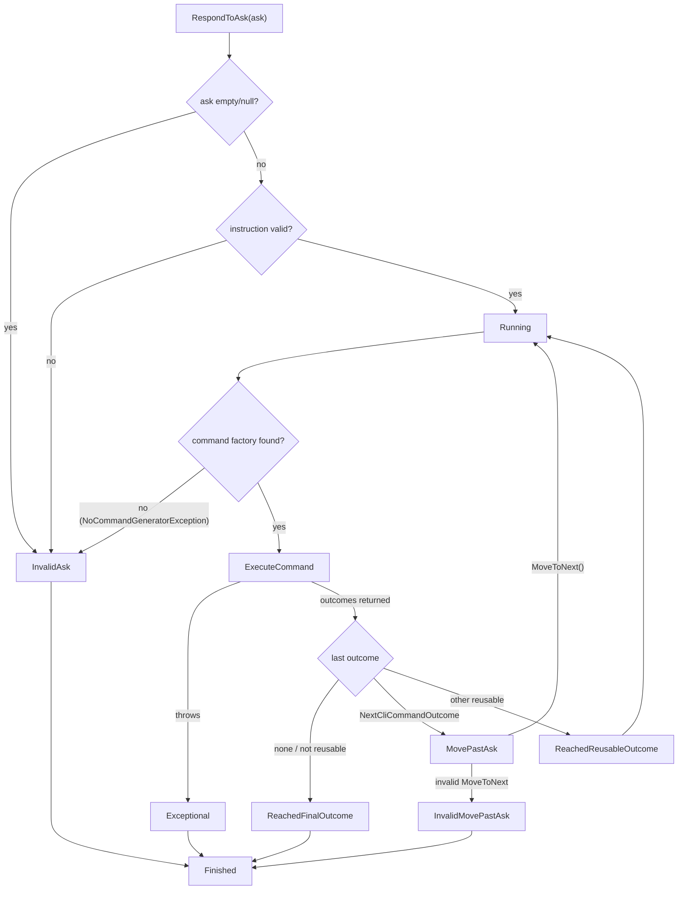

# Workflow run state machine

## Premise

Running a KitCli app means repeatedly turning user input ("asks") into
commands and outcomes, possibly across many separate command
executions, without losing track of what's already happened. `ICliWorkflow`
(`CliWorkflow.cs`) holds a list of `ICliWorkflowRun`s; each
`CliWorkflowRun` (`Run/CliWorkflowRun.cs`) is its own small state machine
tracking one execution from "ask received" through to "finished."

## Problem

At any point, the host (`CliApp`) needs answers to a few questions:

- Is this ask valid?
- Did the command that just ran finish the whole interaction outright,
  does it want another ask, or does it want to run again *without* a
  fresh ask (e.g. paging through a list)?
- What happens if parsing or validation fails, or the command handler
  throws?

Answering those consistently needs one enforced set of legal
transitions, not scattered booleans — otherwise a run can end up in an
inconsistent state (e.g. simultaneously "reached its final outcome" and
"still running"), which surfaces as a silent bug rather than an
exception.

That's not hypothetical: two bugs of exactly that shape existed here
until recently (the run not reaching `Finished` after certain error
paths, and a command-lookup exception that was structurally
uncatchable). Both are resolved on `main` today — neither was ever
filed as a separate tracked issue, since newly-added CI caught and fixed
both directly. See git history for `CliWorkflowRun.cs` for specifics.

## Solution

### The two levels

`CliWorkflow` is the top-level object: a `Runs` list plus a `Status`
(`Started`/`Stopped`). `NextRun()` does **not** always create a new run —
it reuses the single run in `Runs` that hasn't yet reached
`ReachedFinalOutcome`, and only calls `CreateNewRun()` if none exists:

```csharp
public ICliWorkflowRun NextRun()
{
    var lastRunNotHavingReachedFinalOutcome = Runs
        .SingleOrDefault(run => !run.State.WasChangedTo(ClIWorkflowRunStateStatus.ReachedFinalOutcome));

    return lastRunNotHavingReachedFinalOutcome ?? CreateNewRun();
}
```

Each `CliWorkflowRun` exposes exactly two entry points a caller can call:
`RespondToAsk(string? ask)` — parse fresh user input and run the command
it resolves to — and `MoveToNext()` — continue the *same run* into its
next command, using what a prior outcome already queued up, without
waiting on a new ask (used for things like "show the next page").

A run isn't one command; it's the whole arc across as many commands/asks
as it takes to reach a final outcome — `MoveToNext` is just the entry
point for the steps in that arc that don't need fresh input to keep
going.

### The state machine itself

The run's state (`CliWorkflowRunState.cs`) is the actual finite state
machine: an append-only history of every status change, plus a fixed
table of allowed from/to pairs. Changing status looks up the most
recently reached one, checks that table, and throws if the transition
isn't listed — the table is the entire contract for what's legal:

| From | To |
|---|---|
| `Created` | `InvalidAsk`, `Running` |
| `Running` | `InvalidAsk`, `Exceptional`, `ReachedReusableOutcome`, `MovePastAsk`, `ReachedFinalOutcome` |
| `InvalidAsk` | `Finished` |
| `Exceptional` | `Finished` |
| `ReachedReusableOutcome` | `Running` |
| `MovePastAsk` | `Running`, `InvalidMovePastAsk` |
| `InvalidMovePastAsk` | `Finished` |
| `ReachedFinalOutcome` | `Finished` |

Note that `ReachedReusableOutcome` and `MovePastAsk` both loop back to
`Running` rather than going straight to `Finished` — that loop is how a
multi-turn or multi-page run keeps going without ending the state
machine.

### Walking the actual flow



`RespondToAsk`:
- Empty/null ask → `ChangeTo(InvalidAsk)`, return early.
- Parses via `IInstructionParser` (see
  [instruction-parsing-pipeline.md](instruction-parsing-pipeline.md));
  if `IInstructionValidator` accepts it → `ChangeTo(Running, instruction)`,
  otherwise → `ChangeTo(InvalidAsk)`, return early.
- Looks up a command via `ICliWorkflowCommandProvider.GetCommand(...)`.
  If no factory exists for the instruction (`NoCommandGeneratorException`)
  → `ChangeTo(InvalidAsk)`, then explicitly calls `UpdateStateWhenFinished()`
  itself, because this catch fires *before* `ExecuteCommand` is ever
  reached — there's no `ExecuteCommand`-owned `finally` block to fall
  through to here.
- Otherwise, hands off to `ExecuteCommand`.

`ExecuteCommand`:
- Runs the command through `ISender.Send`, prepends a
  `RanCliCommandOutcome` marker to the returned outcomes, publishes any
  `ReactionOutcome`s via `IPublisher`, then calls `UpdateStateAfterOutcome`
  with the full outcome array.
- Any exception anywhere in that → `ChangeTo(Exceptional)`.
- A `finally` block always calls `UpdateStateWhenFinished()` on the way
  out, whichever path was taken.

`UpdateStateAfterOutcome` looks only at the **last** outcome returned
(see [outcomes.md](outcomes.md) for what outcomes and their `Kind`
mean) to decide the next status:

- No outcomes, or the last one isn't reusable → `ReachedFinalOutcome`.
- The last one is a `NextCliCommandOutcome` → `MovePastAsk` (the run is
  now waiting on a `MoveToNext()` call, not a fresh ask).
- Any other reusable outcome → `ReachedReusableOutcome`.

`UpdateStateWhenFinished` checks whether the run has *ever* reached one
of the three "run over" statuses (`ReachedFinalOutcome`, `InvalidAsk`,
`Exceptional`) and, if so, transitions to `Finished`.

Because it checks the run's whole history rather than just the most
recent change, it's safe to call from more than one place — both
`RespondToAsk`'s `NoCommandGeneratorException` catch and
`ExecuteCommand`'s `finally` call it — without double-finishing a run
that's already finished.

`MoveToNext` is only valid if some outcome in the run's history so far
was a `NextCliCommandOutcome` (`IsValidMovePastAsk`); it takes the
**last** such outcome and re-executes its `NextCommand` through the same
`ExecuteCommand` path.

## Constraints & tradeoffs

**An explicit transition table as data, over inline conditionals.**
Illegal transitions throw immediately with a clear message pointing at
exactly which from/to pair was rejected — at the cost of the table
needing to be kept in sync by hand every time a status or transition is
added. Nothing generates it from the code that actually performs
transitions.

**There must never be more than one active run per workflow — enforced by `SingleOrDefault`, not the type system.**
`CliWorkflow.NextRun()` assumes there is never more than one run in
`Runs` that hasn't reached `ReachedFinalOutcome`. Today that's true by
construction, not by luck: the only caller of `NextRun()` is
`CliApp.Run`'s own loop (`KitCli/CliApp.cs`), which awaits a run to
completion before it ever loops back around to ask `_workflow` for the
next one. Nothing else in KitCli calls `NextRun()` concurrently.

If that ever changed — a second caller driving the same `ICliWorkflow`,
or a host that doesn't await each run to completion before starting
another — `SingleOrDefault` would throw a generic
`InvalidOperationException` on the *next* call, not necessarily at the
moment the second run was actually created, and not a domain-specific
error type. This is a known, tracked gap, not a deliberate choice.

**Run and state-change history are never evicted.** Both
`CliWorkflow.Runs` and `CliWorkflowRunState.Changes` simply grow for the
life of the process. Fine for a short CLI invocation; worth knowing
about before reusing a long-lived `CliWorkflow` in, say, a long-running
host process.

## Questions & answers

**What decides whether a run continues after a command, versus ending?**
The *last* outcome the handler returned — see [outcomes.md](outcomes.md)
for what outcomes and `OutcomeKind` mean. This doc only covers how that
decision maps onto run state, not the outcome model itself. A command
handler that ends the run just needs its last outcome to be `Final`-kind
— e.g. the real `ExitCliCommandHandler`
(`KitCli.Workflow.Commands/Exit/ExitCliCommandHandler.cs`):

```csharp
public override Task<Outcome[]> HandleCommand(ExitCliCommand command, CancellationToken cancellationToken)
{
    cliWorkflow.Stop();
    var outcome = new FinalSayOutcome("Exiting CLI workflow.");
    return Task.FromResult<Outcome[]>([outcome]);
}
```

`FinalSayOutcome(Something)` (`Outcomes/Final/FinalSayOutcome.cs`) is
`Outcome(OutcomeKind.Final)` — its last-outcome status drives
`UpdateStateAfterOutcome` straight to `ReachedFinalOutcome`. (Yes, its
message property really is named `Something`, not `Message` — a known,
tracked naming slip, not a typo in this doc.)

**Can two runs be "in progress" on the same workflow at once?**
Not by design — see the constraint above. `NextRun()` always resumes the
one incomplete run if one exists, rather than starting a second one
alongside it.

**Why does `RespondToAsk` sometimes call `UpdateStateWhenFinished()` directly instead of just letting `ExecuteCommand` handle it?**
Because the `NoCommandGeneratorException` case never reaches
`ExecuteCommand` at all — there's no command to execute, so there's no
`finally` block downstream to rely on. `RespondToAsk` finishes the run
itself, right where the failure that ends it actually happened.

## Related concepts

- [outcomes.md](outcomes.md) — what a command handler actually returns,
  and how `OutcomeKind` maps onto the state transitions this doc covers.
- [artefacts.md](artefacts.md) — `CliWorkflowCommandProvider` builds the
  artefact list from the run's outcome history before a command factory
  runs.
- [instruction-parsing-pipeline.md](instruction-parsing-pipeline.md) —
  how the raw ask string `RespondToAsk` receives becomes the
  `Instruction` it parses and validates.
- [0001-mediatr-for-command-dispatch.md](../adr/0001-mediatr-for-command-dispatch.md) —
  why the resolved `CliCommand` is routed to its handler via MediatR
  rather than a hand-written type switch.
