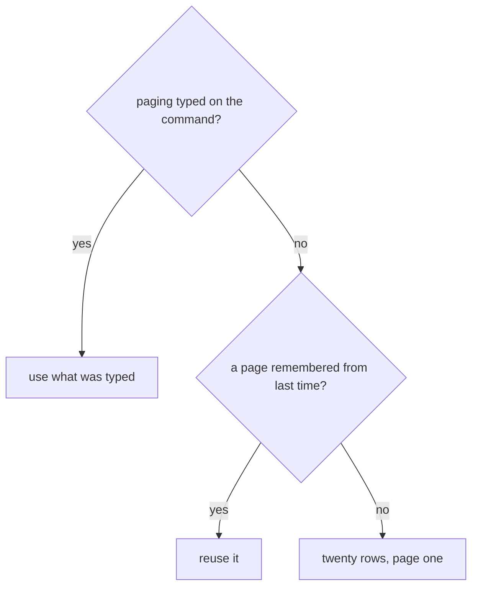

# 0012. Showing a paged table

## What this is for

A list too long to read at once. The reader sees a page, asks for the
next, and gets it — while your second command rebuilds nothing:

```
> /list-expenses                    > /next-page
+------------------------+          +------------------------+
| Category  | Total Cost |          | Category  | Total Cost |
|-----------+------------|          |-----------+------------|
| Groceries | 412.80     |          | Transport | 88.45      |
|-----------+------------|          |-----------+------------|
| Rent      | 1150.00    |          | Coffee    | 63.20      |
+------------------------+          +------------------------+
```

Start from [0011-showing-a-table.md](0011-showing-a-table.md). Your
registry must call `AddArtefactFactoriesForAssembly` (see
[0004-creating-a-registry.md](0004-creating-a-registry.md)), or the second
command finds nothing.

## How to do it

**1. Remember the builder** when you show the first page:

```csharp
var tableBuilder = new ExpenseTableBuilder()
    .WithAggregator(aggregator)
    .WithMap<ExpenseTableMap>()
    .WithPageSize(20)
    .WithPageNumber(1);

return FinishThisCommand()
    .ByShowingTable(tableBuilder.Build())
    .ByRememberingPageSize(20)
    .ByRememberingPageNumber(1)
    .ByRememberingHowToBuildTable(tableBuilder)
    .EndAsync();
```

**2. Collect it back** in the next command's factory:

```csharp
public class NextExpensePageCliCommandFactory : PagedCliCommandFactory<NextExpensePageCliCommand>
{
    public override bool CanCreateWhen() => LastCommandWas<ListExpensesCliCommand>();

    public override CliCommand Create()
    {
        var tableBuilder = GetRequiredArtefact<TableBuilder<Expense, ExpenseRow>>();
        var (pageSize, pageNumber) = GetPaging();

        return new NextExpensePageCliCommand(tableBuilder.Value, pageSize, pageNumber);
    }
}
```

**3. Turn the page** in its handler, and remember where you got to:

```csharp
command.TableBuilder
    .WithPageSize(command.PageSize)
    .WithPageNumber(command.PageNumber);

return FinishThisCommand()
    .ByShowingTable(command.TableBuilder.Build())
    .ByRememberingPageSize(command.PageSize)
    .ByRememberingPageNumber(command.PageNumber)
    .EndAsync();
```

### Where the page number comes from

`GetPaging()` takes what was typed, else the page they were on, else
twenty and one. Both of these work through the one factory:

```
/next-page --pageNumber 3
/next-page
```



## Common mistakes

**Writing `--page-number`.** The names are `pageNumber` and `pageSize`,
camelCase. Anything else is a different argument, and ignored.

**Rebuilding the aggregator and map in the second command.**
`ByRememberingHowToBuildTable` exists so you reconstruct none of it.

**Forgetting to remember the new page.** The reader walks from page one
every time.

## Learn more

- [0010-reusable-outcomes-and-the-workflow-run.md](0010-reusable-outcomes-and-the-workflow-run.md) —
  remembering anything between commands.
- [../concepts/0008-artefacts.md](../concepts/0008-artefacts.md) — how a
  remembered builder reaches the next factory.
